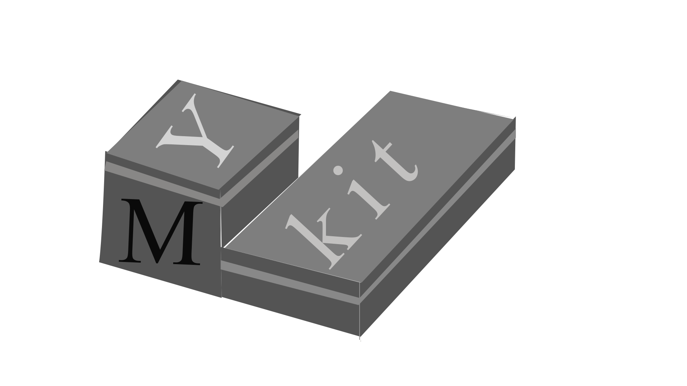

## Test Page

An image, using absolute path:


Using relative path:



Shell:

```sh
echo "foo bar"

string="Lorem ipsum dolor sit amet, consectetur adipiscing elit. Nullam rhoncus diam eget nisi luctus, eu tincidunt arcu finibus. Morbi aliquam commodo fringilla. Curabitur bibendum vestibulum velit, nec consectetur nulla aliquet et. Donec dapibus orci at metus facilisis, nec venenatis ipsum tincidunt. In laoreet eleifend enim, a sagittis enim pretium eu. Aliquam erat volutpat. Mauris euismod purus et risus eleifend, sed ullamcorper risus pulvinar. Vestibulum ut tristique velit. Nunc ac metus sed augue interdum vulputate."
```

Python:

```python
text = "Hello World!"
trimmed_text = text[:-1]
print(trimmed_text)

string = 'Lorem ipsum dolor sit amet, consectetur adipiscing elit. Nullam rhoncus diam eget nisi luctus, eu tincidunt arcu finibus. Morbi aliquam commodo fringilla. Curabitur bibendum vestibulum velit, nec consectetur nulla aliquet et. Donec dapibus orci at metus facilisis, nec venenatis ipsum tincidunt. In laoreet eleifend enim, a sagittis enim pretium eu. Aliquam erat volutpat. Mauris euismod purus et risus eleifend, sed ullamcorper risus pulvinar. Vestibulum ut tristique velit. Nunc ac metus sed augue interdum vulputate.'
```